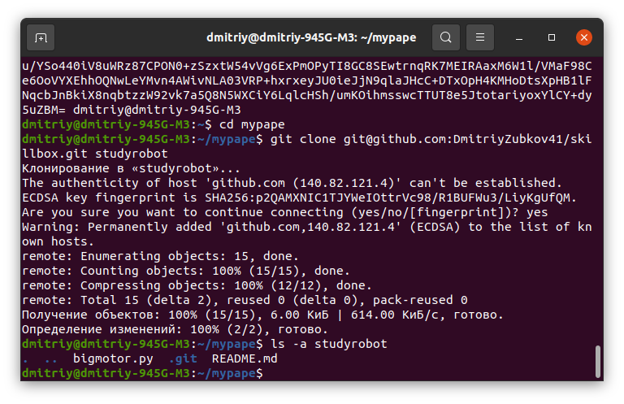

<h3 align=center>История моих действий по выполнению задания№4</h3>
05.06.2024: 
<ol>
<li>Создал папку для будущего проекта: <b>mkdir mypape/studyrobot</b>
<li>Перешел в нее: <b>cd mypape/studyrobot</b>
<li>Создал в ней репозиторий: <b>git init</b>
<li>В VScode в mypape/studyrobot создал файл  motor1.py
<li><b>git add motor1.py</b> в индекс
<li><b>git commit -m "Первый коммит"</b> снимок
<li>Создал motor2.py
<li>Снова <b>git add motor2.py</b> 
<li><b>git commit -m "добавил в проект мотор2"</b>. Ветка называется main, странно не master
<li>Зашел на https://github.com/
<li>Уже был зарегистрирован. Нажал на кнопку New. 
Назвал этот удаленный репозиторий "skillbox" Заполнил Description, видимость private. 
Автоматически был создан readme.md. Поскольку по заданию в этом файле у меня должен быть отчет, начал его заполнять.
<li>Сделал в удаленном репо первый коммит.</li>
<li>Для меня был сюрприз, что текст в режиме Preview выглядит совсем по другому, нет перевода строк как в режиме Edit. По заданию рекомендуется для редактирования использовать MarkDown, но поскольку я лет 20 назад неплохо знал html и еще совсем его не забыл, не буду тратить время на изучение MarkDown, вся разметка тут выполнена/будет выполнена на html.</li>
<li>Сделал коммит.
<li>Создал файл bigmotor.py. Коммит. Теперь у меня в удаленном репозитории skillbox 2 файла.</li>
<li>Теперь я собираюсь клонировать удаленный skillbox на studyrobot (так по заданию). Но в studyrobot уже есть репозиторий, поторопился с его созданием, самому интересно что получится. 
</ol>
06.06.2024:
<ol>
<li>Выполнил команду клонирования в каталог studyrobot, выдала ошибку, что такой каталог уже существует. Я, долго не думая, просто удалил его со своего компьютера. Повторил команду клонирования. Далее, если не изменяет память, на этапе ввода пароля, вышла ошибка 403 (отказ в доступе). Проверил доступ (push) к другому репо на гитхаб, команда выполнилась. Странно, получается, что созданный токен действует только для одного репозитория. 
<li>Токен - пройденный этап, решил создать пароль для авторизации на основе ssh. Потратил много времени на поиск где вводить ssh-key и где можно скопировать мой ssh-путь к моему репо. 
В правом верхнем углу гитхаба открываем меню, заходим в settings, в левой панели выбираем <b>SSH and GPS keys</b> - это чтобы создать ssh-key 
Чтобы скопировать путь к репо через ssh, с гитхаба заходим на мой <a href="https://github.com/DmitriyZubkov41/skillbox">репозиторий</a>. Далее нажимаем кнопку Code. 
<li>На своем компьютере выполняю команду <b>ssh-keygen</b>. Прописываю полный путь к создаваемому ключу. Далее наверное полчаса-час потратил на то, чтобы скопировать код созданного публичного ключа. Похоже с nano нельзя скопировать в системный буфер обмена. Проблему решил с помощью команды cat. Создал ssh-key на гитхабе.
<li> Выполнил команду <b>git clone git@github.com:DmitriyZubkov41/skillbox.git studyrobot</b>. Никакого пароля не пришлось вводить, все прошло как надо. Выкладываю скрин. В начале видно текст моего публичного ключа (рузультат выполнения cat) и в конце для подтверждения  выполнил ls склонированного каталога.  

<li>Эти 4 первых пункта, я выполнил вчера, сейчас просто запротоколировал. 
Теперь что я делаю сейчас: 
<b>git add --all</b> 
<b>git commit -m "изменил readme и добавил папку image"</b> 
Смотрю, что с файлами командой git status
<li><b>git push origin main</b> отправил изменения на удаленный skillbox. Убедился, что всё работает как надо.